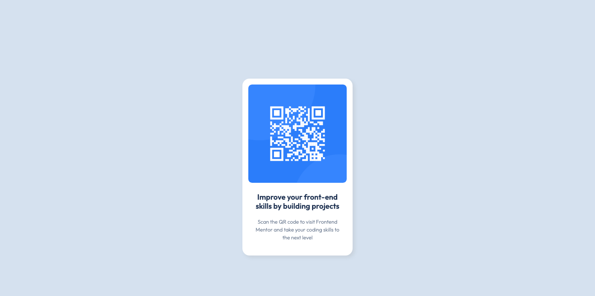

## Building QR code component

This is my solution to the [QR code component challenge on Frontend Mentor](https://www.frontendmentor.io/challenges/qr-code-component-iux_sIO_H). 

## Table of contents

- [Overview](#overview)
  - [Screenshot](#screenshot)
  - [Link](#link)
- [My process](#my-process)
  - [Built with](#built-with)
  - [What I learned](#what-i-learned)
  - [Continued development](#continued-development)
  - [Useful resources](#useful-resources)
- [Author](#author)

## Overview

This project is one of the first steps in my front-end development journey. The goal was to recreate a QR code card from a provided design using HTML and CSS.

While the challenge is simple, it gave me practical experience turning a static design into a functional webpage. It strengthened my understanding of core front-end fundamentals such as semantic HTML, CSS layout, spacing, positioning, and attention to visual detail. 

More importantly, it helped me build the habit of approaching development tasks by breaking a design into smaller, manageable parts and solving each part methodically.

### Screenshot



### Links

- Live Site URL: https://ewusiessel.github.io/qr-code-component/

## My process

### Built with

- Semantic HTML5 markup
- CSS custom properties
- Basic CSS positioning and layout techniques

### What I learned

During this project, I gained a clearer understanding of how block-level elements stack naturally on a page and how absolute positioning can override the normal flow when more precise placement is required.

I also improved my problem-solving process by learning to break a challenge into smaller steps.

```css
.white-card {
        width: 280px;
        height: 450px;
        background-color: white;
        margin-top: 200px;
        margin-left: auto;
        margin-right: auto;
        border-radius: 18px;
        box-shadow: 5px 5px 10px 0px rgba(151, 151, 151, 0.2);
      }
```
```css
   img {
        width: 250px;
        position: absolute;
        margin: 15px;
        border-radius: 9.5px;
      }
```

### Continued development

As I continue building projects, I want to deepen my understanding of Flexbox, responsive design, and modern layout techniques so I can build interfaces that are more adaptable, scalable, and closer to production-ready standards.

### Useful resources

- (https://developer.mozilla.org/en-US/docs/Web/CSS/Reference/Properties/line-height) - This helped me discover the line-height property for fine-tuning the spacing between text
- (https://www.joshwcomeau.com/css/center-a-div/) - This is an amazing article which helped me  understand the concept of centering with margin auto property and centering text.

## Author

- Frontend Mentor - [@ewusiessel](https://www.frontendmentor.io/profile/ewusiessel)
